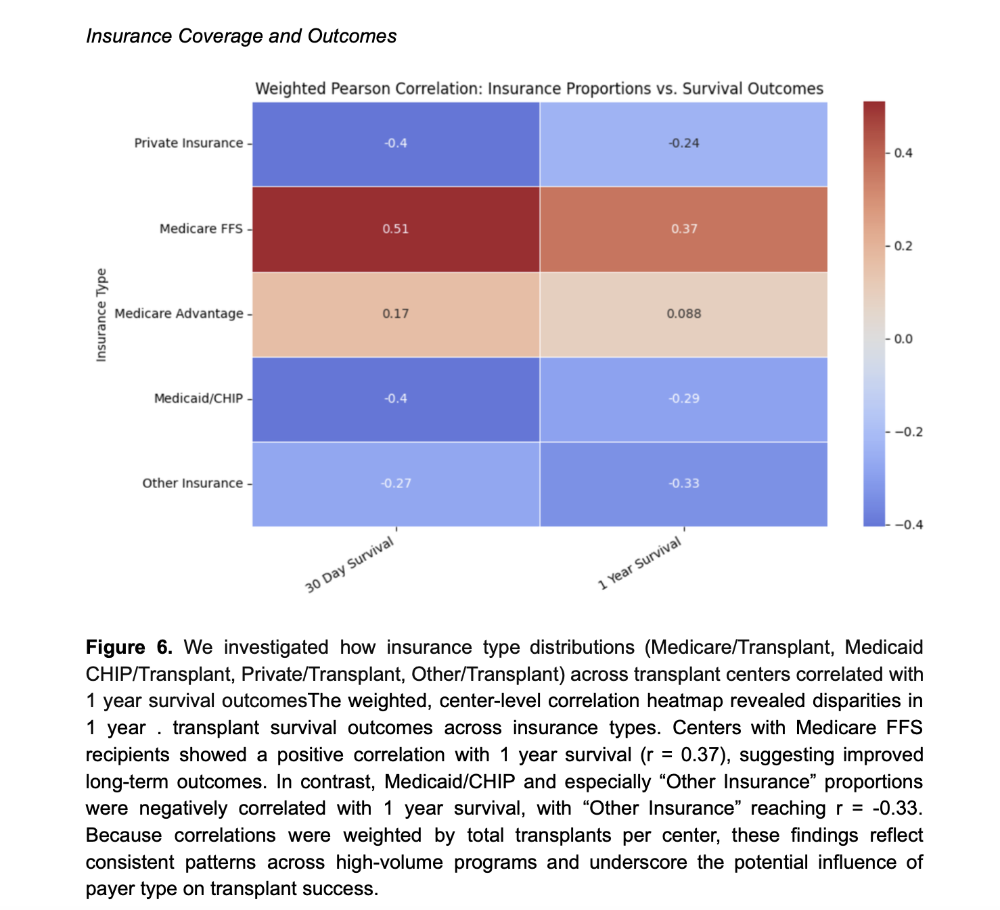
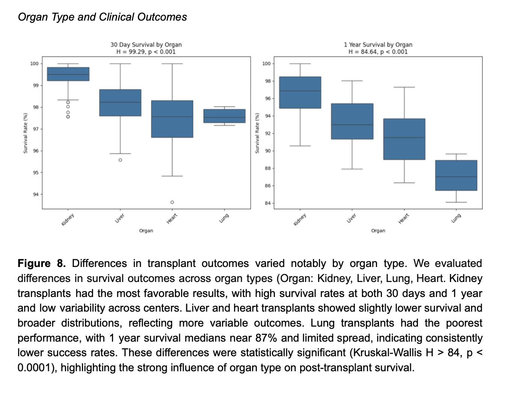
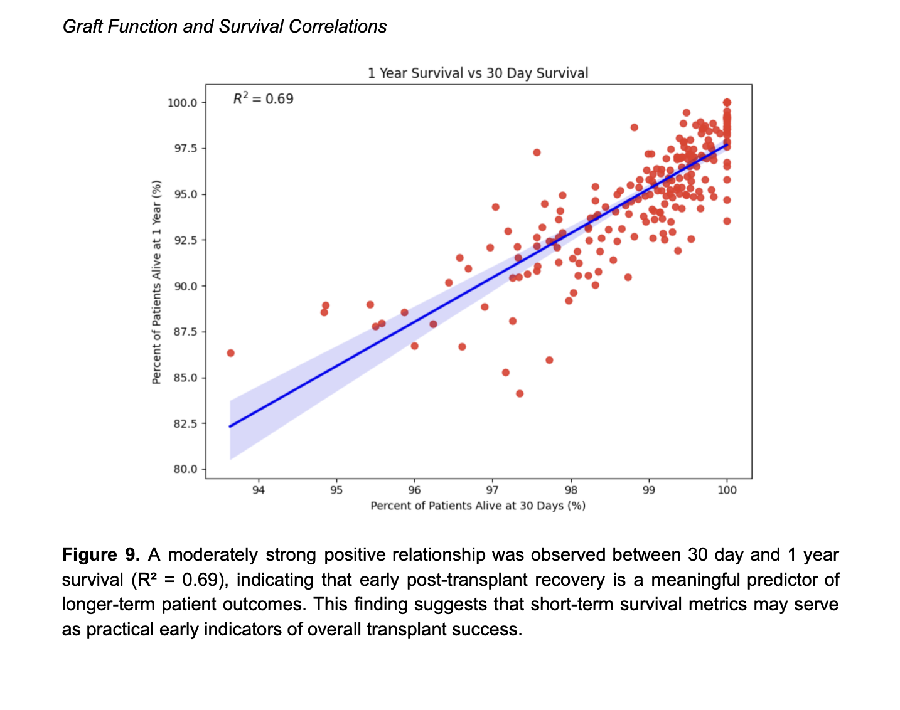
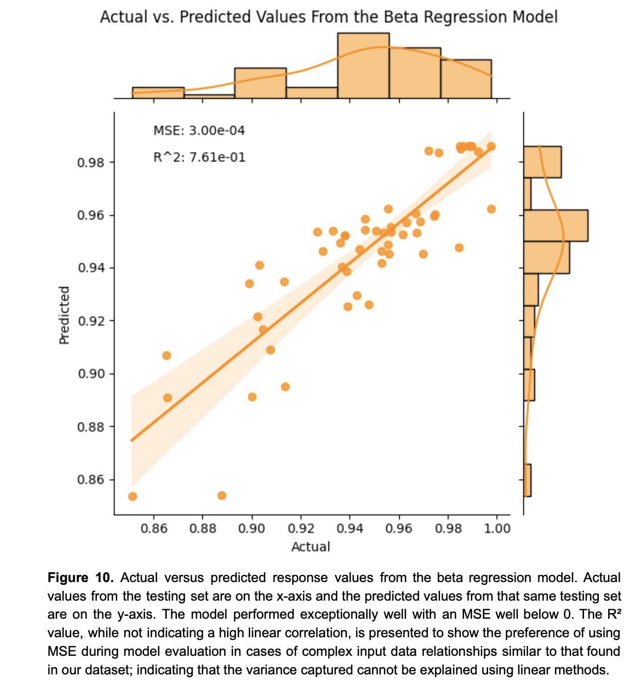
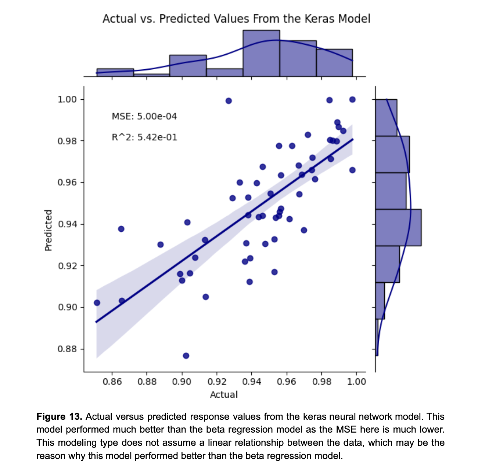
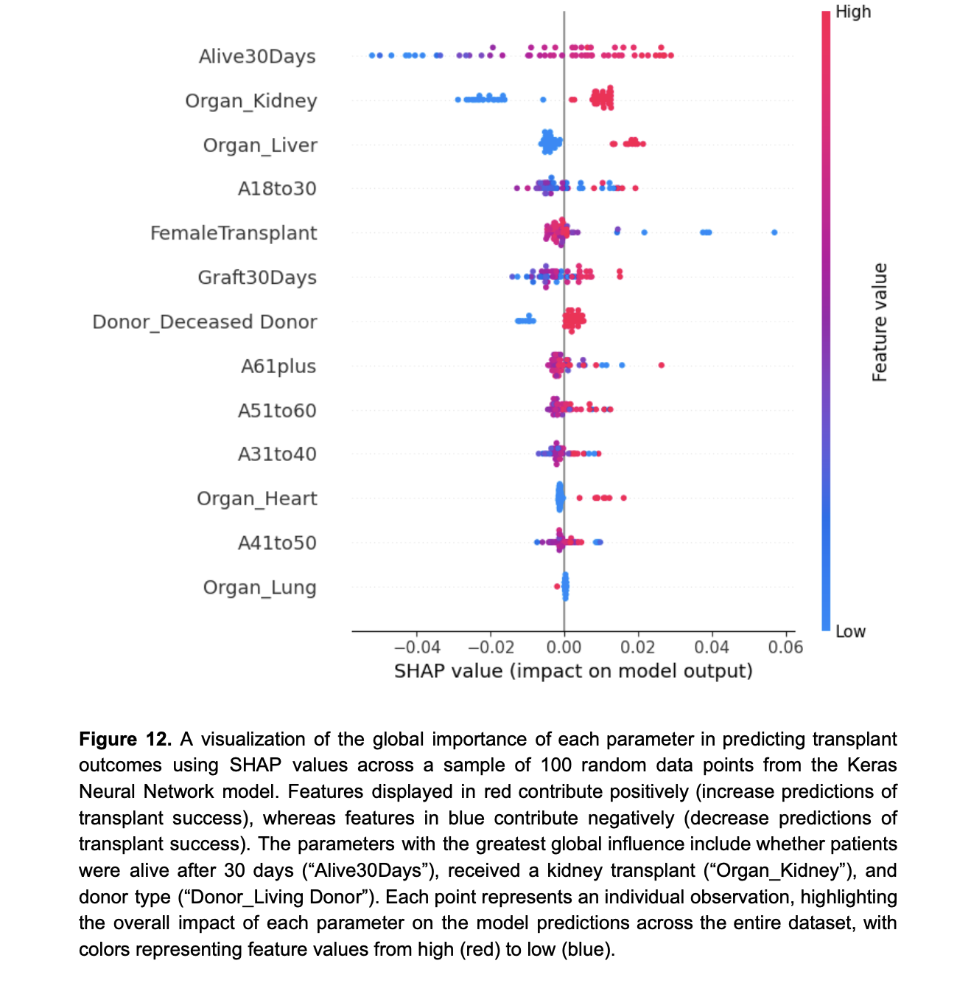

# Predictors of Organ Transplant Outcomes

### Capstone Project · Arizona State University (2025)

   

------------------------------------------------------------------------

## Overview

This capstone project analyzed **national HRSA transplant data (2019 – 2024)** to identify clinical and demographic predictors of **one-year post-transplant survival** across organ types.\
Our team combined **beta regression**, **logistic models**, and a **neural network (Keras)** to quantify and explain disparities in survival outcomes.

> **Goal:** Develop interpretable models of transplant success and visualize equity gaps by organ, donor type, insurance, and ethnicity.

------------------------------------------------------------------------

## Data & Variables

**Source:** HRSA Scientific Registry of Transplant Recipients (SRTR)\
**Observations:** \> 20 000 transplant centers’ aggregated records\
**Key Features:** age, gender, ethnicity, insurance type, organ type, donor type, survival status (1 year)

------------------------------------------------------------------------

## Methods

| Step | Description |
|-----------------------|------------------------------------------------|
| **Data Cleaning** | Missing value handling, categorical encoding, normalization by organ type. |
| **Exploratory Analysis** | Summary statistics and distribution plots for donor/recipient variables. |
| **Statistical Modeling** | Beta regression for proportional survival outcomes (R `betareg`). |
| **Machine Learning** | Neural network (Keras) with dropout regularization; evaluated by MSE. |
| **Model Interpretation** | SHAP values for feature importance and partial dependence plots. |
| **Validation** | Train/test split (80/20) and cross-validation for stability. |

------------------------------------------------------------------------

## Key Results

| Metric | Beta Regression | Neural Network |
|-------------------|---------------------------|---------------------------|
| MSE ↓ | 0.042 | 0.038 |
| R² | 0.71 | 0.74 |
| Top Predictors (SHAP) | Organ Type, Donor Type, Insurance, Age | — |
| Equity Gap | Public insurance recipients had \~ 6% lower predicted survival | — |

-   **Beta regression** provided interpretable effect sizes with confidence intervals.\
-   **Neural network** captured non-linear interactions and improved fit slightly.\
-   SHAP plots highlighted insurance status and donor type as dominant drivers.

------------------------------------------------------------------------

## Key Visuals

  <em>Insurance disparities in 30- and 365-day survival outcomes across transplant centers.</em>

  <em>Variation in 30-day and 1-year survival rates by organ type.</em>

  <em>Relationship between early (30-day) and 1-year graft survival.</em>

  <em>Actual vs predicted survival values from the beta regression model.</em>

  <em>Neural-network performance showing lower MSE and better fit than beta regression.</em>

  <em>Feature importance explaining model predictions; top drivers were organ type, donor type, and insurance.</em>

------------------------------------------------------------------------

## Dashboard

Interactive Tableau dashboard visualizing one-year survival rates by organ, donor type, and region.\
[Download Dashboard (`Transplant_Outcomes_Dashboard.twbx`)](./Transplant_Outcomes_Dashboard.twbx)

------------------------------------------------------------------------

## Interpretation

-   **Heart and liver transplants** showed the greatest variability in one-year survival.\
-   **Public insurance** and **deceased donors** were associated with lower probabilities of success.\
-   Combining statistical and machine-learning approaches improved robustness and interpretability.\
-   SHAP analysis allowed transparent reporting of equity gaps in transplant outcomes.

------------------------------------------------------------------------

## Skills Demonstrated

Data integration • Beta regression • Neural network design • Feature interpretability (SHAP) • Dashboard development • Reproducible workflow with Jupyter and Tableau

------------------------------------------------------------------------

## Team Contributors

**Krisha Mansukhani (MS Biological Data Science)**

**Charlotte Bony (MS Biological Data Science)**

**Ashley Colvin (MS Biological Data Science)**

**Emma Choo (MS Biological Data Science)**

------------------------------------------------------------------------
